# react-native-essentials-settings

Cross-platform React Native library for reading device and system settings —
color scheme, font scale, locale, time zone, network state, and more —
through a single TypeScript API.

## What it does

Eleven namespaces, one import:

- **Appearance** — color scheme, font scale
- **Display** — width, height, scale, orientation, size
- **Locale** — language, country, RTL, time zone, currency, calendar, temperature unit
- **Network** — connection type, cellular generation, Wi-Fi signal (Android only), latency and speed measurement
- **Device** — app version, build info, hardware model, battery, persistent ID
- **Clipboard** — read, write, check
- **Share** — native share sheet
- **Haptics** — impact, notification, selection, vibrate
- **Launcher** — open URL, dial, email, SMS, system settings
- **Preferences** — plain key-value storage (strings and objects)
- **SecureStorage** — encrypted key-value storage
- **Live hooks** — useColorScheme, useFontScale, useOrientation, useNetworkState, useBattery

Built as a Turbo Module for the New Architecture.

## Demo

Screenshots from the example app, running on iOS Simulator and Android Emulator.

|               Appearance (Light)               |               Appearance (Dark)               |                    Display · Locale                    |
| :--------------------------------------------: | :-------------------------------------------: | :----------------------------------------------------: |
| 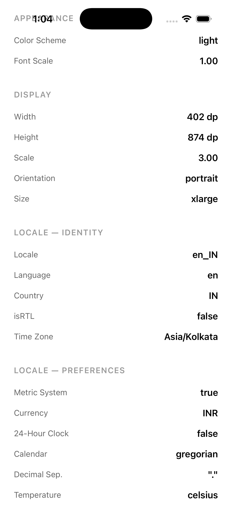 | 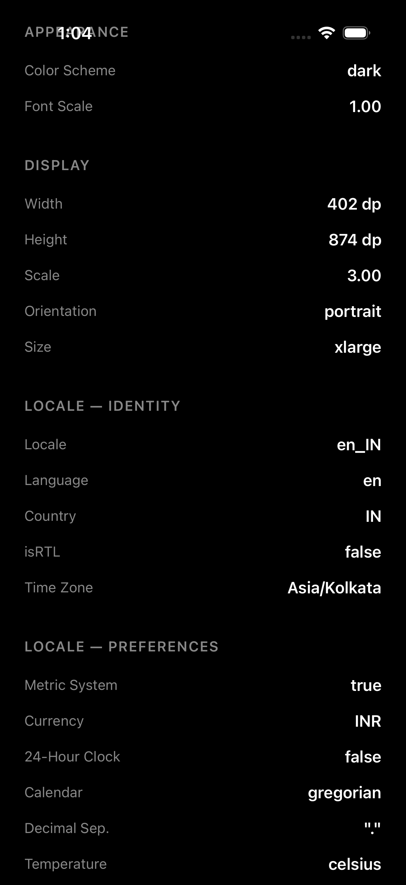 | 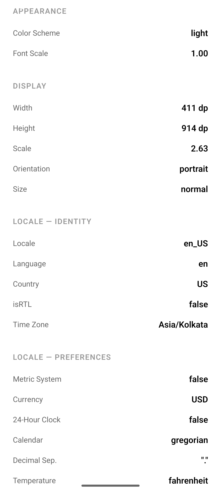 |

|                 Network (iOS)                  |                   Network (Android)                    |                    Haptics                    |
| :--------------------------------------------: | :----------------------------------------------------: | :-------------------------------------------: |
| 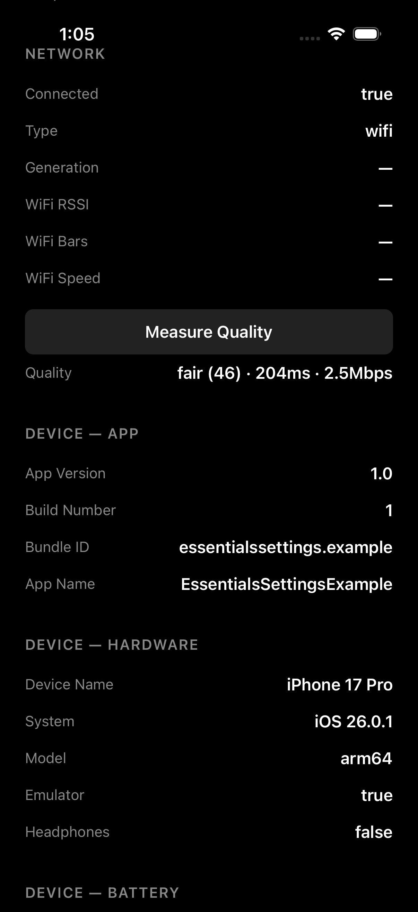 | 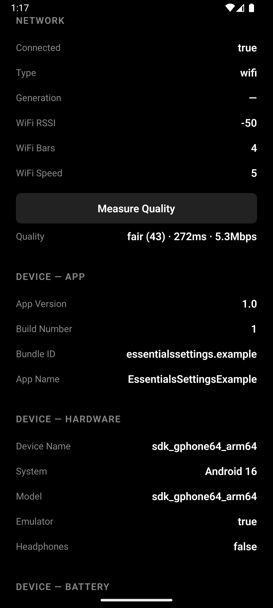 | 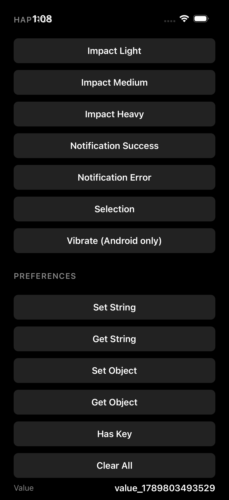 |

|                   Haptics + Preferences                    |                        Launcher                         |                 SecureStorage                 |
| :--------------------------------------------------------: | :-----------------------------------------------------: | :-------------------------------------------: |
| 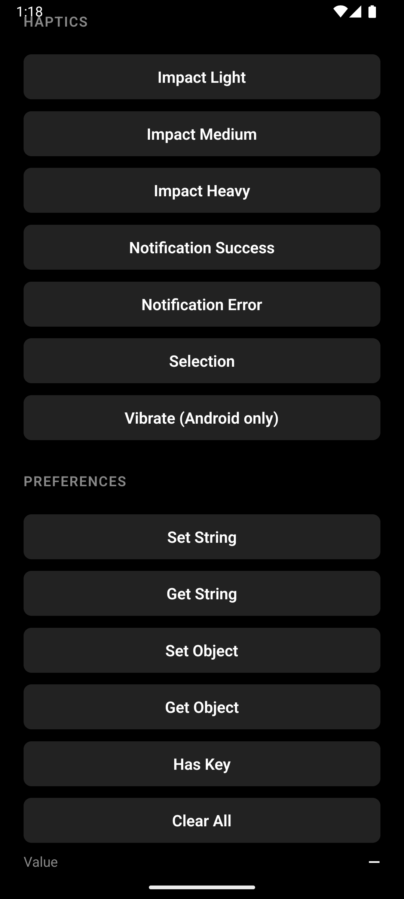 | 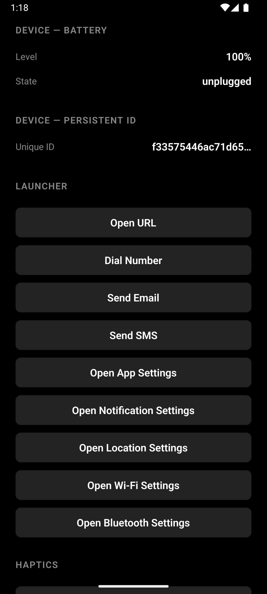 | 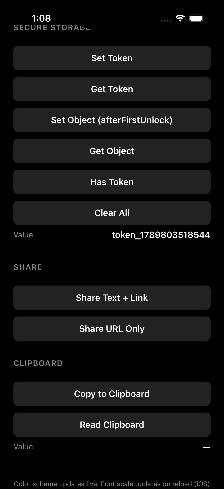 |

|                SecureStorage (Android)                |               Appearance (Android Dark)               |     |
| :---------------------------------------------------: | :---------------------------------------------------: | :-: |
| 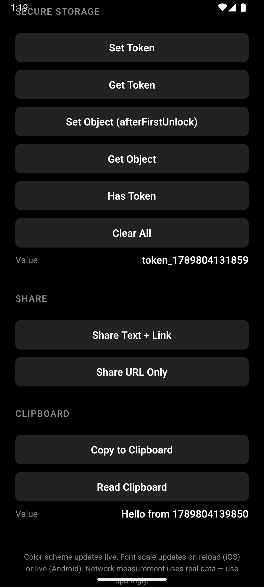 | 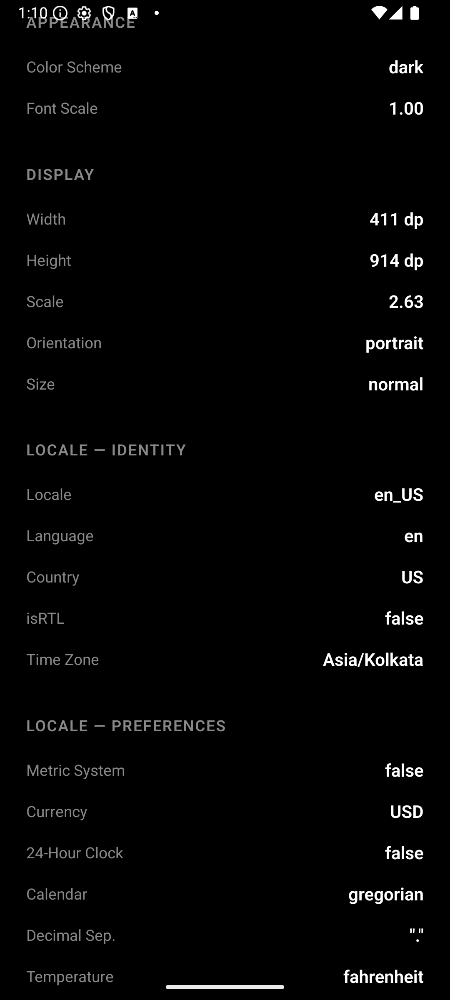 |     |

## Installation

```
npm install react-native-essentials-settings
```

### iOS

```
cd ios && pod install
```

No Podfile changes needed. The podspec links the `Network`, `CoreTelephony`,
and `AVFoundation` system frameworks automatically.

### Android

Add these to your `android/app/src/main/AndroidManifest.xml`:

```xml
<uses-permission android:name="android.permission.ACCESS_NETWORK_STATE" />
```

For haptics, also add:

```xml
<uses-permission android:name="android.permission.VIBRATE" />
```

For the Wi-Fi signal methods, add:

```xml
<uses-permission android:name="android.permission.ACCESS_WIFI_STATE" />

<!-- Android 13+ (API 33+): use this instead of location -->
<uses-permission
    android:name="android.permission.NEARBY_WIFI_DEVICES"
    android:usesPermissionFlags="neverForLocation" />

<!-- Android 12 and below: falls back to location -->
<uses-permission
    android:name="android.permission.ACCESS_FINE_LOCATION"
    android:maxSdkVersion="32" />
```

For `Network.getCellularGeneration()` on Android 11+ (API 30+), add:

```xml
<uses-permission android:name="android.permission.READ_PHONE_STATE" />
```

**This is a runtime permission.** Without it, `getCellularGeneration()`
always returns `null` on Android 11+. The user will see a system permission
prompt the first time your app requests it. If your app doesn't need to
distinguish cellular generations, you can omit this permission and treat
the method as always returning `null`.

## Usage

```ts
import {
  Clipboard,
  Device,
  Display,
  Haptics,
  Launcher,
  Locale,
  Network,
  Preferences,
  SecureStorage,
  Share,
  useBattery,
  useColorScheme,
  useFontScale,
  useNetworkState,
  useOrientation,
} from 'react-native-essentials-settings';

// Appearance
const scheme = useColorScheme(); // 'light' | 'dark' | 'unspecified'
const fontScale = useFontScale(); // 1.0, 1.15, 1.30, ...

// Display
Display.getWidth(); // 390
Display.getHeight(); // 844
Display.getScale(); // 3.0
Display.getOrientation(); // 'portrait' | 'landscape'
Display.getSize(); // 'small' | 'normal' | 'large' | 'xlarge'
const orientation = useOrientation(); // live hook

// Locale — identity
Locale.getLocale(); // 'en_IN'
Locale.getLanguage(); // 'en'
Locale.getCountry(); // 'IN'
Locale.isRTL(); // false
Locale.getTimeZone(); // 'Asia/Kolkata'

// Locale — preferences
Locale.usesMetricSystem(); // true
Locale.getCurrencyCode(); // 'INR'
Locale.uses24HourClock(); // true
Locale.getCalendar(); // 'gregorian'
Locale.getDecimalSeparator(); // '.'
Locale.getTemperatureUnit(); // 'celsius'

// Network — connectivity
Network.isConnected(); // true
Network.getConnectionType(); // 'wifi' | 'cellular' | 'ethernet' | 'none' | 'unknown'
Network.getCellularGeneration(); // '2g' | '3g' | '4g' | '5g' | null

// Network — Wi-Fi signal (Android only, returns null on iOS)
Network.getWifiSignalStrength(); // -45
Network.getWifiSignalLevel(); // 4
Network.getWifiLinkSpeed(); // 433

// Network — measurement (async, hits the network)
await Network.measureLatency(); // 42
await Network.measureDownloadSpeed(); // 45.2
await Network.measurePacketLoss(); // 0.5
await Network.measureQuality();
// { latencyMs, downloadMbps, packetLossPercent, score, tier }

// Network — live hook
const network = useNetworkState();
// { isConnected: true, type: 'wifi', generation: null,
//   quality: 'excellent', qualityLabel: 'Very fast',
//   wifiStrength: -45, wifiBars: 4 }

// Device — app info
Device.getAppVersion(); // '1.0'
Device.getBuildNumber(); // '42'
Device.getBundleId(); // 'com.example.app'
Device.getApplicationName(); // 'My App'

// Device — hardware
Device.getDeviceName(); // "John's iPhone" | 'Pixel 8'
Device.getSystemName(); // 'iOS' | 'Android'
Device.getSystemVersion(); // '26.0' | '16'
Device.getModel(); // 'iPhone17,1' | 'Pixel 8'
Device.isEmulator(); // false
Device.isHeadphonesConnected(); // false

// Device — battery
Device.getBatteryLevel(); // 0.85 | -1.0 if unknown
Device.getBatteryState(); // 'charging' | 'full' | 'unplugged' | 'unknown'

// Device — live battery hook
const battery = useBattery();
// { level: 0.85, state: 'unplugged' }

// Device — persistent ID (async, SHA-256 hashed)
await Device.getUniqueId(); // 'a3f2c1d4e5...'

// Clipboard
await Clipboard.setString('hello');
await Clipboard.getString(); // 'hello'
await Clipboard.hasString(); // true

// Share
await Share.share({ message: 'Check this out!' });
await Share.share({ message: 'Article', url: 'https://example.com' });

// Haptics
Haptics.impact('light'); // 'light' | 'medium' | 'heavy'
Haptics.notification('success'); // 'success' | 'warning' | 'error'
Haptics.selection();
Haptics.vibrate(); // Android only

// Launcher
await Launcher.openURL('https://reactnative.dev');
await Launcher.dial('+919876543210');
await Launcher.email('hi@example.com', { subject: 'Hi', body: '...' });
await Launcher.sms('+919876543210', { body: 'Hi' });
await Launcher.openAppSettings();
await Launcher.openSettings('notification'); // Android only, iOS falls back

// Preferences (plain, unencrypted)
await Preferences.set('theme', 'dark');
await Preferences.get('theme'); // 'dark'
await Preferences.setObject('user', { id: 1 });
await Preferences.getObject('user'); // { id: 1 }
await Preferences.has('theme'); // true
await Preferences.remove('theme');
await Preferences.clear();

// SecureStorage (encrypted)
await SecureStorage.set('token', 'abc123');
await SecureStorage.get('token'); // 'abc123'
await SecureStorage.set('token', 'abc123', 'afterFirstUnlock');
await SecureStorage.setObject('auth', { token: 'abc' });
await SecureStorage.getObject('auth'); // { token: 'abc' }
await SecureStorage.has('token'); // true
await SecureStorage.remove('token');
await SecureStorage.clear();
```

## Live Hooks

Hooks that subscribe to native events and update the UI automatically — no reload required.

| Hook                | Returns                                                                            | Updates when                            |
| ------------------- | ---------------------------------------------------------------------------------- | --------------------------------------- |
| `useColorScheme()`  | `'light' \| 'dark' \| 'unspecified'`                                               | System appearance changes               |
| `useFontScale()`    | `number`                                                                           | Font size changes (reload on iOS)       |
| `useOrientation()`  | `'portrait' \| 'landscape'`                                                        | Device rotates                          |
| `useNetworkState()` | `{ isConnected, type, generation, quality, qualityLabel, wifiStrength, wifiBars }` | Connectivity, type, or signal changes   |
| `useBattery()`      | `{ level, state }`                                                                 | Battery level or charging state changes |

### Network quality tiers

`'offline' | 'poor' | 'fair' | 'good' | 'excellent'`

Derived from connection type and Wi-Fi signal strength:

- Cellular 2G → `poor` · 3G → `fair` · 4G → `good` · 5G → `excellent`
- Wi-Fi uses RSSI thresholds (Android only; iOS defaults to `good`)

### Battery states

`'charging' | 'full' | 'unplugged' | 'unknown'`

## Platform differences

| Signal                    | iOS                    | Android           |
| ------------------------- | ---------------------- | ----------------- |
| Color scheme              | Live                   | Live              |
| Font scale                | Reload required        | Live              |
| Orientation               | Live                   | Live              |
| Network state             | Live                   | Live              |
| Battery                   | Live (real device)     | Live              |
| Wi-Fi signal              | Not available          | Available         |
| Battery level             | -1.0 on Simulator      | Available         |
| Model identifier          | Host arch on Simulator | Device model      |
| Haptics                   | iPhone 7+              | Requires vibrator |
| Specific settings screens | App settings only      | Full support      |

**Font scale on iOS** only updates on app reload. React Native's core doesn't
propagate the system notification reliably, so a reload is needed for now.

**Wi-Fi signal methods return `null` on iOS.** Apple doesn't expose Wi-Fi
signal strength to third-party apps, so there's no workaround.

**Network measurement methods make real requests.** `measureQuality()`
downloads around 100 KB and fires multiple HTTP requests. Don't call it on
every render — cache the result.

**Battery info on iOS Simulator** returns -1.0 (unknown) because the simulator
has no battery. On a real device, this works normally.

**Model identifier on iOS Simulator** returns the host CPU architecture
(e.g. arm64) rather than the simulated device model. On real devices it
returns iPhone17,1, iPhone16,2, and so on.

**Clipboard on iOS 16+** shows a system "Allow Paste?" prompt the first time
your app reads the clipboard. This is Apple's design — there's no way to
bypass it. Writing to the clipboard never prompts.

**Haptics don't work on Simulator or Emulator.** They require physical
hardware. The code runs without error on simulators — you just won't feel
anything.

**`Launcher.openSettings(screen)` is Android-focused.** Apple only allows
third-party apps to open their own settings page, so on iOS all values fall
back to the app settings page. Android opens the requested screen directly.

**SecureStorage on Android handles device migration.** If a user restores a
backup onto a new device, the encrypted preferences file is restored but the
hardware-bound Keystore key is not. Without handling, this would cause a crash
on the first secure read. The library detects this case and clears the stale
encrypted storage so the app opens normally. The user's old secure values are
lost (they were unrecoverable anyway), and the user simply re-authenticates.

**SecureStorage accessibility on iOS.** The default is `'whenUnlocked'`, which
means the item is only readable while the device is unlocked. If your app needs
to read secure values in the background (push notifications, background sync,
widgets), pass `'afterFirstUnlock'` instead:

```ts
await SecureStorage.set('token', 'abc', 'afterFirstUnlock');
```

Available values: `'whenUnlocked'` (default), `'afterFirstUnlock'`,
`'whenUnlockedThisDeviceOnly'`, `'afterFirstUnlockThisDeviceOnly'`.

**Privacy note about `Device.getUniqueId()`.** This returns a SHA-256 hash
of a persistent identifier (Android ID on Android, a Keychain-stored UUID on
iOS). It resets on factory reset and can change when the app's signing key
changes. Do not use it for advertising or cross-app tracking.

## Requirements

- React Native 0.76 or later
- iOS 12+
- Android API 24+
- New Architecture enabled (default since RN 0.76)

## Development

This repo is a Yarn 4 monorepo with two packages:

- `react-native-essentials-settings` — the library
- `react-native-essentials-settings-example` — demo app

Run everything from the repo root:

```
yarn install              # install dependencies
yarn example ios          # run the iOS demo
yarn example android      # run the Android demo
yarn test                 # run tests
yarn typecheck            # check types
yarn lint                 # lint
```

Don't run `npm install` or `npx react-native run-*` from inside `example/`.
It bypasses the workspace and will fail.

## Changelog

See [CHANGELOG.md](./CHANGELOG.md) for a detailed list of changes per version.

## Contributing

- [Development workflow](CONTRIBUTING.md#development-workflow)
- [Sending a pull request](CONTRIBUTING.md#sending-a-pull-request)
- [Code of conduct](CODE_OF_CONDUCT.md)

## License

MIT

---

Made with [create-react-native-library](https://github.com/callstack/react-native-builder-bob)
